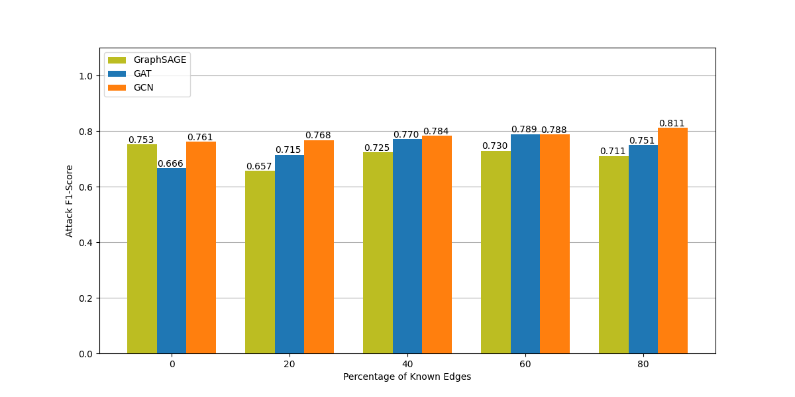
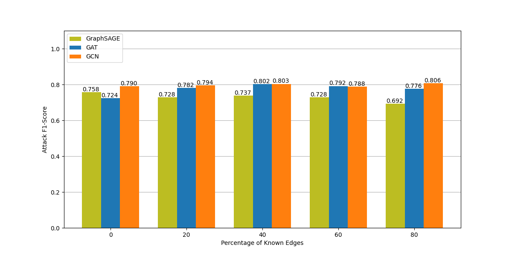
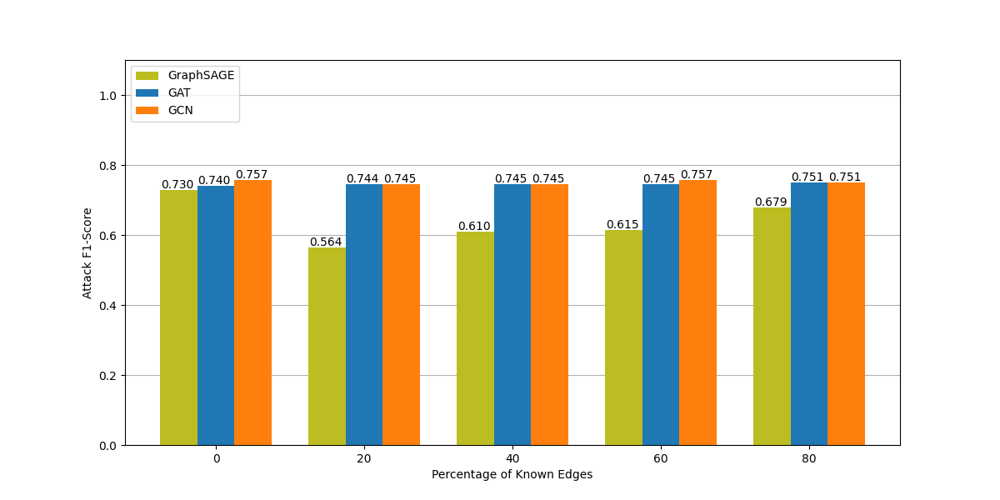
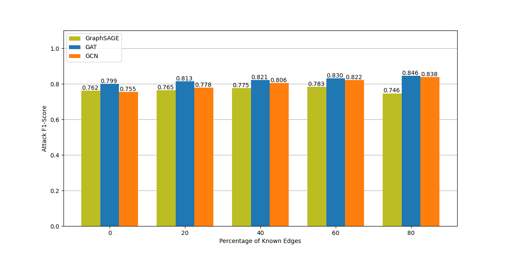
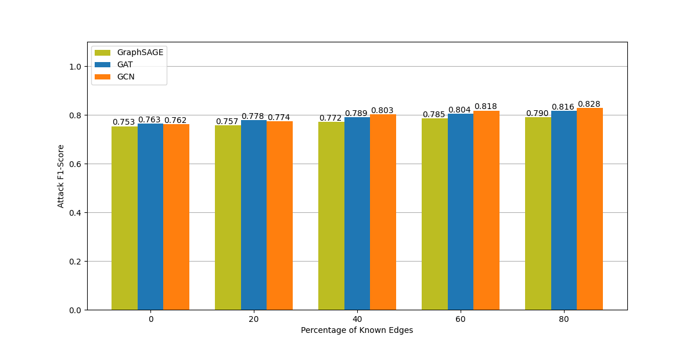
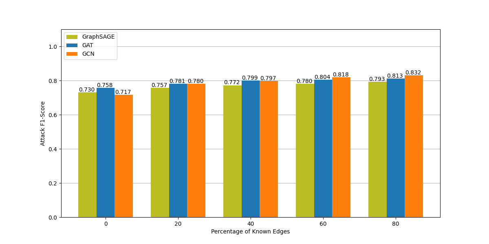
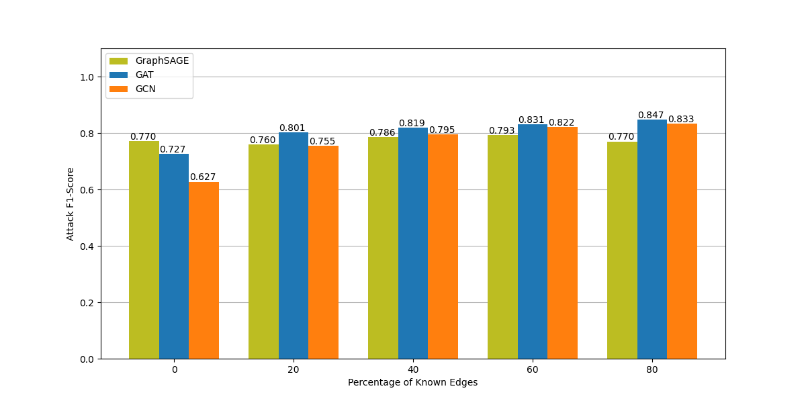

# Experiment

> Experiment for Bachelor Thesis: Link Stealing Attacks on Inductive Trained Graph Neural Networks

## Datasets
To train, evaluate and test our target and attacker models, we used three citation graph-datasets.

| Dataset  | Domain   | Nodes | Edges | Features | Classes
|---       |---       |---    |---    |---       |---
| Cora     | Citation | 2708  | 5429  | 1433     | 7
| CiteSeer | Citation | 3327  | 4732  | 3703     | 6
| Pubmed   | Citation | 19717 | 44338 | 500      | 3

#### Cora
The [Cora](https://paperswithcode.com/dataset/cora) dataset consists of 2708 scientific publications classified into one of seven classes. The citation network consists of 5429 links. Each publication in the dataset is described by a 0/1-valued word vector indicating the absence/presence of the corresponding word from the dictionary. The dictionary consists of 1433 unique words.

#### Citeseer
The [CiteSeer](https://paperswithcode.com/dataset/citeseer) dataset consists of 3312 scientific publications classified into one of six classes. The citation network consists of 4732 links. Each publication in the dataset is described by a 0/1-valued word vector indicating the absence/presence of the corresponding word from the dictionary. The dictionary consists of 3703 unique words.

#### Pubmed
The [Pubmed](https://paperswithcode.com/dataset/pubmed) dataset consists of 19717 scientific publications from PubMed database pertaining to diabetes classified into one of three classes. The citation network consists of 44338 links. Each publication in the dataset is described by a TF/IDF weighted word vector from a dictionary which consists of 500 unique words.

## Models

### Targets
As our target models we choose GraphSAGE Networks, Graph Convolutional Networks and Graph Attention Networks. Each GNN type is trained on all three datasets such that we have 9 target models in total. They are trained to perform a node classification task. More precisely, given a few labeled nodes, the network is able to predict the labels of the other nodes.

| Model     | Epochs | Optimizer | Hidden Layer | Hidden Nodes | Learning Rate | Dropout
|---        |---     |---        |---           |---           |---            |---
| GraphSAGE | 200    | Adam      | 2            | 16           | 0.01          |0.5  
| GAT       | 200    | Adam      | 1            | 8            | 0.0005        |0.6
| GCN       | 200    | Adam      | 2            | 16           | 0.01          |0.5  

#### GraphSAGE Networks
`TODO` Description

| Dataset  | Accuracy
|---       |---
| Cora     | 83.05
| CiteSeer | 56.72
| Pubmed   | 89.38

#### Graph Attention Networks
`TODO` Description

| Dataset  | Accuracy
|---       |---
| Cora     | 77.78
| CiteSeer | 60.88
| Pubmed   | 89.13

#### Graph Convolutional Network
`TODO` Description

| Dataset  | Accuracy
|---       |---
| Cora     | 75.45
| CiteSeer | 57.23
| Pubmed   | 87.74

### Attacker
As our attacker model we use a multi-layer-perceptron. It is trained to perform a link stealing attack based on the posterior output of the attacked target model.

| Epochs | Optimizer | Hidden Layer | Hidden Nodes | Learning Rate | Dropout
|---     |---        |---           |---           |---            |---
| 200    | Adam      | 2            | 16           | 0.01          |0.5

## Link Stealing Attacks
We want to show that it is possible for an attacker to steal links from graphs given an inductive trained Graph Neural Network. Therefor we assume the attacker has a graph, but is not sure about the completeness of the edges. Especially, maybe there are some edges between nodes missing in the graph. For two given nodes `i` and `j`, we want to infer whether they are connected or not (whether the edge is missing or really isn't existent).

### Attack 1
> Same Source Dataset -- Posterior Concatenation

#### Thread Model
- **Model :** Black Box Access (Querry Access) to target
- **Dataset :** Same distribution dataset (training or testing)
- **Node Topology :** No edges, 20%, 40%, 60%, 80% known edges

#### Attack Methodology
- A dataset `d` is split into `traingraph` and `testgraph`
- The target model `target` is trained on the `traingraph` to perform some task like node classification
  - **Input :** Node's features, its neighbors' features and the edges between them
  - **Output:** Some posterior

- Create attackers raw-dataset `da-raw` based on `testgraph`
  - Create modified graph `mod-g`
    - `mod-g` = `testgraph`
    - Collect a set `pos` that contains pairs of nodes, that are connected in `testgraph` and delete these edges in `mod-g`
    - Collect a set `neg` that contains pairs of nodes, that are not connected in `testgraph`
    - **Example :** `(i,j)` in `pos` indicated that `i` and `j` are connected  in `testgraph`
  - `mod-g` = `testgraph` without the edges that have been used to sample `pos`
  - `da-raw` =  `pos` + `neg`

- Sample attackers dataset `da` with `da-raw`
  - Query `target` on both nodes
  - Get posteriors for both nodes
  - Concatenate posteriors to obtain the feature
  - Use 1 (`pos`) or 0 (`neg`) as label
  - **Example :** `(post_cat, 1)` indicates, that the nodes the posteriors came from, have been connected to each other in `testgraph` and that the edge does not exist in `mod-g` anymore (is missing in `mod-g`)

- Train Attacker Model `attacker` on `da`
  - **Input :** Posterior Concatenation
  - **Output :** Prediction whether both nodes have been connected or not

### Attack 2
> Same Source Dataset -- 8 Distances

#### Thread Model
- **Model :** Black Box Access (Querry Access) to target
- **Dataset :** Same distribution dataset (training or testing)
- **Node Topology :** No edges, 20%, 40%, 60%, 80% known edges

#### Attack Methodology
- A dataset `d` is split into `traingraph` and `testgraph`
- The target model `target` is trained on the `traingraph` to perform some task like node classification
  - **Input :** Node's features, its neighbors' features and the edges between them
  - **Output:** Some posterior

- Create attackers raw-dataset `da-raw` based on `testgraph`
  - Create modified graph `mod-g`
    - `mod-g` = `testgraph`
    - Collect a set `pos` that contains pairs of nodes, that are connected in `testgraph` and delete these edges in `mod-g`
    - Collect a set `neg` that contains pairs of nodes, that are not connected in `testgraph`
    - **Example :** `(i,j)` in `pos` indicates that `i` and `j` are connected  in `testgraph`
  - `mod-g` = `testgraph` without the edges that have been used to sample `pos`
  - `da-raw` =  `pos` + `neg`

- Sample attackers dataset `da` with `da-raw`
  - Query `target` on both nodes
  - Get posteriors for both nodes
  - Calculate 8 different distances between the node vectors to obtain the feature
  - Use 1 (`pos`) or 0 (`neg`) as label
  - **Example :** `(distances, 1)` indicates, that the nodes of which the distances have been calculated on, have been connected to each other in `testgraph` and that the edge does not exist in `mod-g` anymore (is missing in `mod-g`)

- Train Attacker Model `attacker` on `da`
  - **Input :** Distances
  - **Output :** Prediction whether both nodes have been connected or not

### Attack 3
> Different Source Dataset -- 8 Distances

#### Thread Model
- **Model :** Black Box Access (Querry Access) to target
- **Dataset :** Same distribution dataset (training or testing)
- **Node Topology :** No edges, 20%, 40%, 60%, 80% known edges

#### Attack Methodology
- The target model `target` is trained on a dataset `d-target` to perform some task like node classification
  - **Input :** Node's features, its neighbors' features and the edges between them
  - **Output:** Some posterior

- Create attackers raw-dataset `da-raw` based on a dataset `d-attacker`, which is different than `d-target`
  - Create modified graph `mod-g`
    - `mod-g` = `d-attacker`
    - Collect a set `pos` that contains pairs of nodes, that are connected in `d-attacker` and delete these edges in `mod-g`
    - Collect a set `neg` that contains pairs of nodes, that are not connected in `d-attacker`
    - **Example :** `(i,j)` in `pos` indicates, that `i` and `j` are connected  in `d-attacker`
  - `mod-g` = `d-attacker` without edges that have been used to sample `pos`
  - `dat-raw` =  `pos` + `neg`

- Sample attackers dataset `da` with `da-raw`
  - Query `target` on both nodes
  - Get posteriors for both nodes
  - Calculate 8 different distances between the node vectors to obtain the feature
  - Use 1 (`pos`) or 0 (`neg`) as label
  - **Example :** `(distances, 1)` indicates, that the nodes of which the distances have been calculated on, have been connected to each other in `d-attacker` and that the edge does not exist in `mod-g` anymore (is missing in `mod-g`)

- Train Attacker Model `attacker` on `da`
  - **Input :** Distances
  - **Output :** Prediction whether both nodes have been connected or not

## Results
We consider no edges known (graph only contains nodes and no edges) as our baseline.

### Attack 1

### Attack 2

### Attack 3

