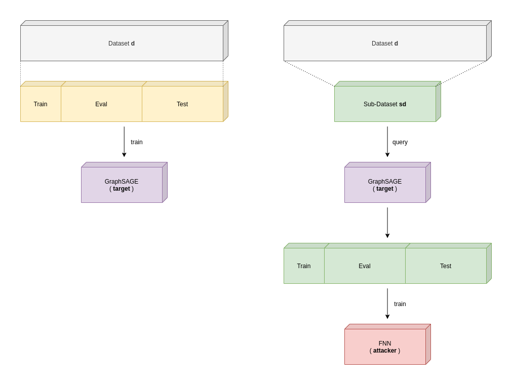
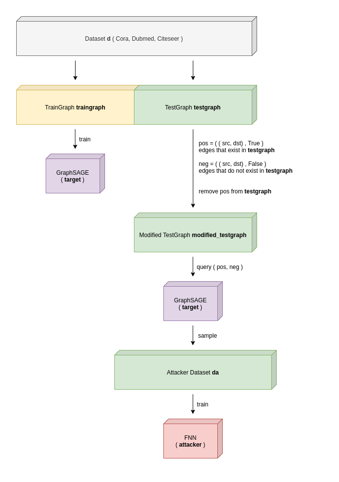

# Link Stealing Attack - Evaluation

> Transductive and Inductive Link Stealing Attacks on GraphSAGE GNNs

## Target model - GraphSAGE GNN

#### Approach
Given a graph with a few labeled nodes the model performs label prediction on the unlabeled ones. For calculation of the feature / embedding vectors, GraphSAGE is used. GraphSage calculates the embedding of node `i` based on their neighborhood (connected nodes).

#### Parameter
| Parameter     | Value     
|------         |------     
| Type          | GraphSAGE
| Epochs        | 200
| Hidden Layer  | 2         
| Hidden Nodes  | 16         
| Learning Rate | 0.01      
| Dropout       | 0.5

## Attacker model - Fully Connected Neural Network

#### Approach
Given a Graph Neural Network the model performs a link stealing attack based on the posteriors that are generated by the GNN.

#### Parameter
| Parameter     | Value     
|------         |------     
| Type          | FNN
| Epochs        | 200
| Hidden Layer  | 2         
| Hidden Nodes  | 16        
| Learning Rate | 0.01       
| Dropout       | 0.5

## Attacks

### Attack 1 - Transductive
#### Setup
- Dataset `d`
- Target model `target` is trained on `d`
- Attacker model `attacker` queries `target` on node-pairs
- predicts based on posteriors whether they are connected or not

#### Knowledge of Attacker
- Target Dataset `d` that was used for training `target`
- Query Access to Target model `target`

#### Dataset Generation

###### Target Model
- Split `d` into train, eval and test

###### Attacker Model
- Create Sub-Dataset `sd` based on Dataset `d` ( equal to test-mask of target )
- `sd` contains nodes ( e.g. [234, 423, 456, 32, 12, ..., 2345, 778 ] )
- pairs of nodes are queried on `target` to obtain two posteriors
- both posteriors are concatenated into one feature vector for `attacker`
- original graph is queried for the label ( whether an edge exists between the two nodes )

#### Training the Attacker Model
One feature vector, consisting of two posteriors, is the input for the model. It then predicts whether the two nodes, of which the posteriors came from, are connected or not. The label is used for calculating the loss and updating the network.

#### Results
| (Parent) Dataset  | Target | Attacker     
|------             |------  |-------
| Cora              | 0.8437 | 0.9465
| Citeseer          | 0.7256 | 0.9414
| Pubmed            | 0.8513 | 0.9978
| Reddit            | -      | -

### Attack 2 - Inductive
#### Setup
- Dataset `d`
- Target model `target` is trained on **subgraph** of `d`
- Attacker model `attacker` queries `target` on node-pairs
- predicts based on posteriors whether they are connected or not

#### Knowledge of Attacker
- Target Dataset `d` that was used for training `target`
- Query Access to Target model `target`

#### Dataset Generation
- Split Dataset `d` into `traingraph` and `testgraph`

###### Target Model
- Train Target Model `target` on `traingraph`
- No validating or testing

###### Attacker Model
- Remove random edges from `testgraph`
  - `modified_testgraph`
- Query `target` on `modified_testgraph` to obtain attacker dataset `da`
  - positive samples - edges that have been removed from `testgraph`
  - negative samples - edges that didn't exist in `testgraph`
- Train Attacker model `attacker` on `da`

#### Training the Attacker Model
One feature vector, consisting of two posteriors, is the input for the model. It then predicts whether the two nodes, of which the posteriors came from, are connected or not. The label is used for calculating the loss and updating the network.

#### Results
| (Parent) Dataset  | Target | Attacker     
|------             |------  |-------
| Cora              | 0.5415 | 0.6444
| Citeseer          | 0.4902 | 0.6273
| Pubmed            | 0.6952 | 0.6085
| Reddit            | -      | -
