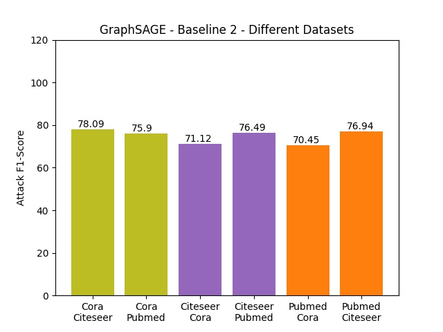
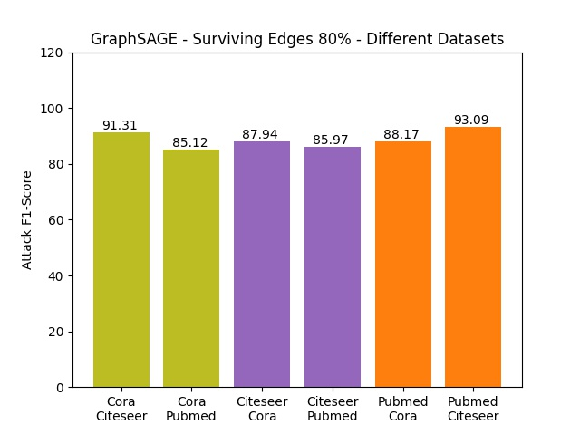

# Link Stealing Attacks - Evaluation

> Link Stealing Attacks on inductive trained Graph Neural Networks

## Target Models

#### Task
Given a graph with a few labeled nodes the model performs label prediction on the unlabeled ones. For calculation of the feature / embedding vectors, all model types calculate the embedding of node `i` based on their neighborhood (connected nodes).

#### Models and their Accuracy
<table>
    <thead>
        <tr>
            <th>Type</th>
            <th>Dataset</th>
            <th>Accuracy</th>
        </tr>
    </thead>
    <tbody>
        <tr>
            <td rowspan=3>graphsage</td>
            <td>cora</td>
            <td>0.8304</td>
        </tr>
        <tr>
            <td>citeseer</td>
            <td>0.5672</td>
        </tr>
        <tr>
            <td>pubmed</td>
            <td>0.8938</td>
        </tr>
        <tr>
            <td rowspan=3>gat</td>
            <td>cora</td>
            <td>0.7778</td>
        </tr>
        <tr>
            <td>citeseer</td>
            <td>0.6088</td>
        </tr>
        <tr>
            <td>pubmed</td>
            <td>0.8913</td>
        </tr>
        <tr>
            <td rowspan=3>gcn</td>
            <td>cora</td>
            <td>0.7546</td>
        </tr>
        <tr>
            <td>citeseer</td>
            <td>0.5724</td>
        </tr>
        <tr>
            <td>pubmed</td>
            <td>0.8774</td>
        </tr>
</tbody>
</table>

## Attacker model - Multi-Layer Perceptron

#### Task
Given a Graph Neural Network the model performs a link stealing attack based on the posteriors that are generated by the GNN.

#### Parameter
| Parameter     | Value
|------         |------
| Type          | MLP
| Epochs        | 200
| Hidden Layer  | 2
| Hidden Nodes  | 16
| Learning Rate | 0.01
| Dropout       | 0.5
| Optimizer     | Adam

#### Threat Model
- Model: Black Box Access ( Query Access ) to Target Model `target`
- Dataset: Same distribution dataset (training or testing)
- Node-topology: No edge, 20%, 40%, 60%, 80% known edges;

#### Attack Methodology
> Example: Social Network like Instagram or Facebook

- Social Network
    - Nodes: People
    - Edges: Connection between people if they know each other

- Target Model `target` that has been trained on the Social Network to perform some Task
    - Input: Node's feature ( maybe also its neighbors' features and the edges between them )
    - Output: Some posterior

- Create Raw Attacker Training Dataset `raw-train`
    - Collect `pos` ( node pairs of people that are connected )
    - Collect `neg` ( node pairs of people that are not connected )
    - E.g.: (NodeID_1, NodeID_2, True) in `pos` would mean that NodeID_1 and NodeID_2 know each other / are connected
    - `raw-train` = `pos` + `neg`

- Sample `attacker-train` with `raw-train`
    - Query `target` on both nodes
    - Get posteriors for both nodes
    - Concatinate the posteriors as feature
    - Use 1 (`pos`) or 0 (`neg`) as label
    - E.g.: (Posterior_Concat, 0) means that the nodes of which the posteriors came from haven't known each other / haven't been connected

- Train Attacker Model `attacker`
    - Input: Posterior Concatination
    - Output: Prediction whether both nodes are connected or not

#### Approach

> Example: Social Network like Instagram or Facebook

Now it is possible to predict whether two private accounts are connected to each other or not. Since information like this are sensitive, this is a privacy breach.

## Attacks

### Target and Attacker trained on same dataset-distribution

> Example: Social Network like Instagram or Facebook

A GNN was trained on Instagram profiles to predict the salary of people. To train the  `attacker` one could use its own profile, its follower and also the follower of its own follower. The network now contains people that one is connected to and people one doesn't know.

#### Baseline 1
Use train dataset to query (0-hop).

Use the Social Network Graph, the Target Model was trained on to also train the Attacker Model (Knowledge of the dataset needed). Remove all edges but keep in mind, which nodes have been connected. Sample `pos` with nodes that have been connected. Sample `neg` with nodes that haven't. Query the GNN with the modified Social Network Graph to get posteriors to sample features. Train `attacker` on the sampled dataset.

Predict whether one knows people or not.

##### Results
<table>
        <thead>
            <tr>
                <th>Type</th>
                <th>Dataset</th>
                <th>F1-Score</th>
                <th>Precision</th>
                <th>Recall</th>
                <th>Accuracy</th>
            </tr>
        </thead>
        <tbody>
        <tr>
            <td rowspan=3>graphsage</td>
            <td>cora</td>
            <td>0.6688</td>
            <td>0.5892</td>
            <td>0.7732</td>
            <td>0.7023</td>
        </tr>
        <tr>
            <td>citeseer</td>
            <td>0.7992</td>
            <td>0.9338</td>
            <td>0.6985</td>
            <td>0.7645</td>
        </tr>
        <tr>
            <td>pubmed</td>
            <td>0.7678</td>
            <td>0.9248</td>
            <td>0.6564</td>
            <td>0.7178</td>
        </tr>
        <tr>
            <td rowspan=3>gat</td>
            <td>cora</td>
            <td>0.7411</td>
            <td>0.9666</td>
            <td>0.6010</td>
            <td>0.6656</td>
        </tr>
        <tr>
            <td>citeseer</td>
            <td>0.6896</td>
            <td>0.6231</td>
            <td>0.7719</td>
            <td>0.7243</td>
        </tr>
        <tr>
            <td>pubmed</td>
            <td>0.7524</td>
            <td>0.9503</td>
            <td>0.6227</td>
            <td>0.6859</td>
        </tr>
        <tr>
            <td rowspan=3>gcn</td>
            <td>cora</td>
            <td>0.7315</td>
            <td>0.9318</td>
            <td>0.6021</td>
            <td>0.6568</td>
        </tr>
        <tr>
            <td>citeseer</td>
            <td>0.7454</td>
            <td>0.9299</td>
            <td>0.6220</td>
            <td>0.6844</td>
        </tr>
        <tr>
            <td>pubmed</td>
            <td>0.7556</td>
            <td>0.9382</td>
            <td>0.6324</td>
            <td>0.6938</td>
        </tr>
    </tbody>
    </table>

#### Baseline 2
Use test dataset to query (0-hop).

Unfollow everybody but keep in mind, that one know them. Sample `pos` with one self and its former follower. Sample `neg` with one and accounts one doesn't know. Query the GNN with ones modified network to get posteriors to sampled features. Train `attacker` on the sampled dataset.

Predict whether one knows people or not.

##### Results
<table>
        <thead>
            <tr>
                <th>Type</th>
                <th>Dataset</th>
                <th>F1-Score</th>
                <th>Precision</th>
                <th>Recall</th>
                <th>Accuracy</th>
            </tr>
        </thead>
        <tbody>
        <tr>
            <td rowspan=3>graphsage</td>
            <td>cora</td>
            <td>0.6487</td>
            <td>0.5678</td>
            <td>0.7566</td>
            <td>0.6893</td>
        </tr>
        <tr>
            <td>citeseer</td>
            <td>0.7286</td>
            <td>0.7445</td>
            <td>0.7133</td>
            <td>0.7219</td>
        </tr>
        <tr>
            <td>pubmed</td>
            <td>0.7587</td>
            <td>0.9375</td>
            <td>0.6372</td>
            <td>0.7005</td>
        </tr>
        <tr>
            <td rowspan=3>gat</td>
            <td>cora</td>
            <td>0.5732</td>
            <td>0.4639</td>
            <td>0.7500</td>
            <td>0.6517</td>
        </tr>
        <tr>
            <td>citeseer</td>
            <td>0.6790</td>
            <td>0.6322</td>
            <td>0.7332</td>
            <td>0.6936</td>
        </tr>
        <tr>
            <td>pubmed</td>
            <td>0.7538</td>
            <td>0.9557</td>
            <td>0.6223</td>
            <td>0.6857</td>
        </tr>
        <tr>
            <td rowspan=3>gcn</td>
            <td>cora</td>
            <td>0.5651</td>
            <td>0.4703</td>
            <td>0.7078</td>
            <td>0.6411</td>
        </tr>
        <tr>
            <td>citeseer</td>
            <td>0.7715</td>
            <td>0.8822</td>
            <td>0.6855</td>
            <td>0.7302</td>
        </tr>
        <tr>
            <td>pubmed</td>
            <td>0.7255</td>
            <td>0.7580</td>
            <td>0.6956</td>
            <td>0.7125</td>
        </tr>
    </tbody>
    </table>

#### Surviving Edges 20
Unfollow 80% but keep in mind, that one know them. Sample `pos` with one self, its former follower but also its remaining follower. Sample `neg` with one and accounts one doesn't know. Query the GNN with ones modified network to get posteriors to sampled features. Train `attacker` on the sampled dataset.

Predict whether one knows people or not.

##### Results
<table>
        <thead>
            <tr>
                <th>Type</th>
                <th>Dataset</th>
                <th>F1-Score</th>
                <th>Precision</th>
                <th>Recall</th>
                <th>Accuracy</th>
            </tr>
        </thead>
        <tbody>
        <tr>
            <td rowspan=3>graphsage</td>
            <td>cora</td>
            <td>0.7586</td>
            <td>0.9213</td>
            <td>0.6447</td>
            <td>0.7095</td>
        </tr>
        <tr>
            <td>citeseer</td>
            <td>0.7925</td>
            <td>0.9359</td>
            <td>0.6873</td>
            <td>0.7564</td>
        </tr>
        <tr>
            <td>pubmed</td>
            <td>0.7451</td>
            <td>0.8311</td>
            <td>0.6752</td>
            <td>0.7159</td>
        </tr>
        <tr>
            <td rowspan=3>gat</td>
            <td>cora</td>
            <td>0.7411</td>
            <td>0.9635</td>
            <td>0.6022</td>
            <td>0.6690</td>
        </tr>
        <tr>
            <td>citeseer</td>
            <td>0.7520</td>
            <td>0.7789</td>
            <td>0.7268</td>
            <td>0.7470</td>
        </tr>
        <tr>
            <td>pubmed</td>
            <td>0.7351</td>
            <td>0.9849</td>
            <td>0.5864</td>
            <td>0.6459</td>
        </tr>
        <tr>
            <td rowspan=3>gcn</td>
            <td>cora</td>
            <td>0.7202</td>
            <td>0.8919</td>
            <td>0.6040</td>
            <td>0.6615</td>
        </tr>
        <tr>
            <td>citeseer</td>
            <td>0.7372</td>
            <td>0.9536</td>
            <td>0.6008</td>
            <td>0.6595</td>
        </tr>
        <tr>
            <td>pubmed</td>
            <td>0.7605</td>
            <td>0.9569</td>
            <td>0.6311</td>
            <td>0.6973</td>
        </tr>
    </tbody>
    </table>

#### Surviving Edges 40
Unfollow 60% but keep in mind, that one know them. Sample `pos` with one self, its former follower but also its remaining follower. Sample `neg` with one and accounts one doesn't know. Query the GNN with ones modified network to get posteriors to sampled features. Train `attacker` on the sampled dataset.

Predict whether one knows people or not.

##### Results
<table>
        <thead>
            <tr>
                <th>Type</th>
                <th>Dataset</th>
                <th>F1-Score</th>
                <th>Precision</th>
                <th>Recall</th>
                <th>Accuracy</th>
            </tr>
        </thead>
        <tbody>
        <tr>
            <td rowspan=3>graphsage</td>
            <td>cora</td>
            <td>0.7955</td>
            <td>0.9475</td>
            <td>0.6856</td>
            <td>0.7575</td>
        </tr>
        <tr>
            <td>citeseer</td>
            <td>0.8257</td>
            <td>0.9684</td>
            <td>0.7197</td>
            <td>0.7904</td>
        </tr>
        <tr>
            <td>pubmed</td>
            <td>0.7643</td>
            <td>0.9851</td>
            <td>0.6244</td>
            <td>0.6958</td>
        </tr>
        <tr>
            <td rowspan=3>gat</td>
            <td>cora</td>
            <td>0.7607</td>
            <td>0.9602</td>
            <td>0.6298</td>
            <td>0.6983</td>
        </tr>
        <tr>
            <td>citeseer</td>
            <td>0.8104</td>
            <td>0.9695</td>
            <td>0.6961</td>
            <td>0.7709</td>
        </tr>
        <tr>
            <td>pubmed</td>
            <td>0.7242</td>
            <td>0.9945</td>
            <td>0.5694</td>
            <td>0.6238</td>
        </tr>
        <tr>
            <td rowspan=3>gcn</td>
            <td>cora</td>
            <td>0.5572</td>
            <td>0.4350</td>
            <td>0.7750</td>
            <td>0.6545</td>
        </tr>
        <tr>
            <td>citeseer</td>
            <td>0.7836</td>
            <td>0.9172</td>
            <td>0.6839</td>
            <td>0.7496</td>
        </tr>
        <tr>
            <td>pubmed</td>
            <td>0.7505</td>
            <td>0.8341</td>
            <td>0.6821</td>
            <td>0.7223</td>
        </tr>
    </tbody>
    </table>

#### Surviving Edges 60
Unfollow 40% but keep in mind, that one know them. Sample `pos` with one self, its former follower but also its remaining follower. Sample `neg` with one and accounts one doesn't know. Query the GNN with ones modified network to get posteriors to sampled features. Train `attacker` on the sampled dataset.

Predict whether one knows people or not.

##### Results
<table>
        <thead>
            <tr>
                <th>Type</th>
                <th>Dataset</th>
                <th>F1-Score</th>
                <th>Precision</th>
                <th>Recall</th>
                <th>Accuracy</th>
            </tr>
        </thead>
        <tbody>
        <tr>
            <td rowspan=3>graphsage</td>
            <td>cora</td>
            <td>0.8000</td>
            <td>0.9568</td>
            <td>0.6874</td>
            <td>0.7580</td>
        </tr>
        <tr>
            <td>citeseer</td>
            <td>0.8409</td>
            <td>0.9784</td>
            <td>0.7374</td>
            <td>0.8123</td>
        </tr>
        <tr>
            <td>pubmed</td>
            <td>0.7965</td>
            <td>0.9890</td>
            <td>0.6667</td>
            <td>0.7463</td>
        </tr>
        <tr>
            <td rowspan=3>gat</td>
            <td>cora</td>
            <td>0.7830</td>
            <td>0.9816</td>
            <td>0.6512</td>
            <td>0.7348</td>
        </tr>
        <tr>
            <td>citeseer</td>
            <td>0.8116</td>
            <td>0.9721</td>
            <td>0.6966</td>
            <td>0.7698</td>
        </tr>
        <tr>
            <td>pubmed</td>
            <td>0.7500</td>
            <td>0.9943</td>
            <td>0.6021</td>
            <td>0.6649</td>
        </tr>
        <tr>
            <td rowspan=3>gcn</td>
            <td>cora</td>
            <td>0.7833</td>
            <td>0.8723</td>
            <td>0.7109</td>
            <td>0.7616</td>
        </tr>
        <tr>
            <td>citeseer</td>
            <td>0.8223</td>
            <td>0.9163</td>
            <td>0.7459</td>
            <td>0.7960</td>
        </tr>
        <tr>
            <td>pubmed</td>
            <td>0.5904</td>
            <td>0.4508</td>
            <td>0.8552</td>
            <td>0.6859</td>
        </tr>
    </tbody>
    </table>

#### Surviving Edges 80
Unfollow 20% but keep in mind, that one know them. Sample `pos` with one self, its former follower but also its remaining follower. Sample `neg` with one and accounts one doesn't know. Query the GNN with ones modified network to get posteriors to sampled features. Train `attacker` on the sampled dataset.

Predict whether one knows people or not.

##### Results
<table>
        <thead>
            <tr>
                <th>Type</th>
                <th>Dataset</th>
                <th>F1-Score</th>
                <th>Precision</th>
                <th>Recall</th>
                <th>Accuracy</th>
            </tr>
        </thead>
        <tbody>
        <tr>
            <td rowspan=3>graphsage</td>
            <td>cora</td>
            <td>0.7995</td>
            <td>0.9921</td>
            <td>0.6696</td>
            <td>0.7613</td>
        </tr>
        <tr>
            <td>citeseer</td>
            <td>0.8376</td>
            <td>0.9917</td>
            <td>0.7249</td>
            <td>0.8054</td>
        </tr>
        <tr>
            <td>pubmed</td>
            <td>0.7823</td>
            <td>0.9954</td>
            <td>0.6443</td>
            <td>0.7254</td>
        </tr>
        <tr>
            <td rowspan=3>gat</td>
            <td>cora</td>
            <td>0.8041</td>
            <td>0.9822</td>
            <td>0.6807</td>
            <td>0.7584</td>
        </tr>
        <tr>
            <td>citeseer</td>
            <td>0.8133</td>
            <td>0.9978</td>
            <td>0.6864</td>
            <td>0.7670</td>
        </tr>
        <tr>
            <td>pubmed</td>
            <td>0.7800</td>
            <td>0.9962</td>
            <td>0.6409</td>
            <td>0.7216</td>
        </tr>
        <tr>
            <td rowspan=3>gcn</td>
            <td>cora</td>
            <td>0.7506</td>
            <td>0.7474</td>
            <td>0.7538</td>
            <td>0.7536</td>
        </tr>
        <tr>
            <td>citeseer</td>
            <td>0.8279</td>
            <td>0.9607</td>
            <td>0.7273</td>
            <td>0.8031</td>
        </tr>
        <tr>
            <td>pubmed</td>
            <td>0.3810</td>
            <td>0.2396</td>
            <td>0.9298</td>
            <td>0.6105</td>
        </tr>
    </tbody>
    </table>

### Target and Attacker trained on different dataset-distribution

| Attack (target_ds, attacker_ds) |  GNN |  Target Acc | Attacker Acc | Attacker F1-Score
|--- |--- |--- |--- |--- |
| baseline_1_cora_citeseer | graphsage |  69.40 |  82.69 |  84.24
| baseline_2_cora_citeseer | graphsage |  56.72 |  72.71 |  78.09
| surviving_edges_20p_cora_citeseer |  graphsage |  56.72 |  80.40 |  82.90
| surviving_edges_40p_cora_citeseer |  graphsage |  56.72 |  86.41 |  87.29
| surviving_edges_60p_cora_citeseer |  graphsage |  56.72 |  90.75 |  90.69
| surviving_edges_80p_cora_citeseer |  graphsage |  56.72 |  90.69 |  91.31
| baseline_1_cora_pubmed | graphsage |  89.49 |  68.26 |  74.58
| baseline_2_cora_pubmed | graphsage |  89.38 |  70.65 |  75.90
| surviving_edges_20p_cora_pubmed |  graphsage |  89.38 |  75.55 |  79.09
| surviving_edges_40p_cora_pubmed |  graphsage |  89.38 |  79.09 |  81.81
| surviving_edges_60p_cora_pubmed |  graphsage |  89.38 |  80.41 |  83.25
| surviving_edges_80p_cora_pubmed |  graphsage |  89.38 |  82.99 |  85.12
| baseline_1_citeseer_cora | graphsage |  89.61 |  74.26 |  75.24
| baseline_2_citeseer_cora | graphsage |  83.04 |  69.93 |  71.12
| surviving_edges_20p_citeseer_cora |  graphsage |  83.04 |  77.27 |  79.00
| surviving_edges_40p_citeseer_cora |  graphsage |  83.04 |  79.08 |  81.64
| surviving_edges_60p_citeseer_cora |  graphsage |  83.04 |  87.21 |  87.90
| surviving_edges_80p_citeseer_cora |  graphsage |  83.04 |  86.92 |  87.94
| baseline_1_citeseer_pubmed | graphsage |  89.49 |  70.35 |  75.98
| baseline_2_citeseer_pubmed | graphsage |  89.38 |  72.83 |  76.49
| surviving_edges_20p_citeseer_pubmed |  graphsage |  89.38 |  76.71 |  79.59
| surviving_edges_40p_citeseer_pubmed |  graphsage |  89.38 |  77.00 |  80.60
| surviving_edges_60p_citeseer_pubmed |  graphsage |  89.38 |  81.71 |  84.10
| surviving_edges_80p_citeseer_pubmed |  graphsage |  89.38 |  84.29 |  85.97
| baseline_1_pubmed_cora | graphsage |  89.61 |  72.71 |  67.49
| baseline_2_pubmed_cora | graphsage |  83.04 |  60.37 |  70.45
| surviving_edges_20p_pubmed_cora |  graphsage |  83.04 |  76.03 |  78.73
| surviving_edges_40p_pubmed_cora |  graphsage |  83.04 |  82.74 |  82.76
| surviving_edges_60p_pubmed_cora |  graphsage |  83.04 |  86.88 |  87.23
| surviving_edges_80p_pubmed_cora |  graphsage |  83.04 |  87.30 |  88.17
| baseline_1_pubmed_citeseer | graphsage |  69.40 |  80.46 |  82.10
| baseline_2_pubmed_citeseer | graphsage |  56.72 |  70.52 |  76.94
| surviving_edges_20p_pubmed_citeseer |  graphsage |  56.72 |  78.83 |  81.96
| surviving_edges_40p_pubmed_citeseer |  graphsage |  56.72 |  88.08 |  88.54
| surviving_edges_60p_pubmed_citeseer |  graphsage |  56.72 |  89.07 |  89.45
| surviving_edges_80p_pubmed_citeseer |  graphsage |  56.72 |  92.68 |  93.09

| Attack (target_ds, attacker_ds) |  GNN |  Target Acc | Attacker Acc | Attacker F1-Score
|--- |--- |--- |--- |--- |
| baseline_1_cora_citeseer | gat |  77.75 |  79.93 |  83.10
| baseline_2_cora_citeseer | gat |  60.88 |  73.97 |  78.77
| surviving_edges_20p_cora_citeseer |  gat |  60.88 |  80.91 |  82.97
| surviving_edges_40p_cora_citeseer |  gat |  60.88 |  86.44 |  86.70
| surviving_edges_60p_cora_citeseer |  gat |  60.88 |  88.77 |  89.58
| surviving_edges_80p_cora_citeseer |  gat |  60.88 |  89.52 |  90.58
| baseline_1_cora_pubmed | gat |  89.10 |  69.41 |  75.15
| baseline_2_cora_pubmed | gat |  89.13 |  73.39 |  77.26
| surviving_edges_20p_cora_pubmed |  gat |  89.13 |  71.90 |  77.37
| surviving_edges_40p_cora_pubmed |  gat |  89.13 |  79.64 |  82.30
| surviving_edges_60p_cora_pubmed |  gat |  89.13 |  80.11 |  83.01
| surviving_edges_80p_cora_pubmed |  gat |  89.13 |  83.65 |  85.32
| baseline_1_citeseer_cora | gat |  85.71 |  74.69 |  77.15
| baseline_2_citeseer_cora | gat |  77.78 |  63.89 |  71.21
| surviving_edges_20p_citeseer_cora |  gat |  77.78 |  73.66 |  77.96
| surviving_edges_40p_citeseer_cora |  gat |  77.78 |  80.61 |  82.66
| surviving_edges_60p_citeseer_cora |  gat |  77.78 |  80.09 |  82.82
| surviving_edges_80p_citeseer_cora |  gat |  77.78 |  85.91 |  87.30
| baseline_1_citeseer_pubmed | gat |  89.10 |  69.04 |  75.01
| baseline_2_citeseer_pubmed | gat |  89.13 |  73.87 |  77.22
| surviving_edges_20p_citeseer_pubmed |  gat |  89.13 |  75.63 |  79.19
| surviving_edges_40p_citeseer_pubmed |  gat |  89.13 |  79.89 |  82.30
| surviving_edges_60p_citeseer_pubmed |  gat |  89.13 |  78.64 |  82.13
| surviving_edges_80p_citeseer_pubmed |  gat |  89.13 |  83.50 |  85.46
| baseline_1_pubmed_cora | gat |  85.71 |  70.72 |  64.65
| baseline_2_pubmed_cora | gat |  77.78 |  68.67 |  74.17
| surviving_edges_20p_pubmed_cora |  gat |  77.78 |  69.74 |  75.17
| surviving_edges_40p_pubmed_cora |  gat |  77.78 |  78.53 |  81.51
| surviving_edges_60p_pubmed_cora |  gat |  77.78 |  80.99 |  83.29
| surviving_edges_80p_pubmed_cora |  gat |  77.78 |  89.08 |  89.96
| baseline_1_pubmed_citeseer | gat |  77.75 |  81.16 |  82.81
| baseline_2_pubmed_citeseer | gat |  60.88 |  70.44 |  76.07
| surviving_edges_20p_pubmed_citeseer |  gat |  60.88 |  76.01 |  79.47
| surviving_edges_40p_pubmed_citeseer |  gat |  60.88 |  79.54 |  83.07
| surviving_edges_60p_pubmed_citeseer |  gat |  60.88 |  90.48 |  90.80
| surviving_edges_80p_pubmed_citeseer |  gat |  60.88 |  90.66 |  91.09

| Attack (target_ds, attacker_ds) |  GNN |  Target Acc | Attacker Acc | Attacker F1-Score
|--- |--- |--- |--- |--- |
| baseline_1_cora_citeseer | gcn |  71.11 |  71.98 |  76.77
| baseline_2_cora_citeseer | gcn |  57.24 |  72.08 |  75.96
| surviving_edges_20p_cora_citeseer |  gcn |  57.24 |  70.15 |  75.81
| surviving_edges_40p_cora_citeseer |  gcn |  57.24 |  73.02 |  77.61
| surviving_edges_60p_cora_citeseer |  gcn |  57.24 |  75.29 |  78.81
| surviving_edges_80p_cora_citeseer |  gcn |  57.24 |  84.62 |  85.41
| baseline_1_cora_pubmed | gcn |  90.35 |  50.60 |  66.83
| baseline_2_cora_pubmed | gcn |  87.74 |  72.19 |  76.57
| surviving_edges_20p_cora_pubmed |  gcn |  87.74 |  73.83 |  77.97
| surviving_edges_40p_cora_pubmed |  gcn |  87.74 |  78.61 |  80.92
| surviving_edges_60p_cora_pubmed |  gcn |  87.74 |  79.91 |  82.28
| surviving_edges_80p_cora_pubmed |  gcn |  87.74 |  82.40 |  84.38
| baseline_1_citeseer_cora | gcn |  89.83 |  69.71 |  74.04
| baseline_2_citeseer_cora | gcn |  75.46 |  54.91 |  67.10
| surviving_edges_20p_citeseer_cora |  gcn |  75.46 |  51.57 |  65.30
| surviving_edges_40p_citeseer_cora |  gcn |  75.46 |  73.31 |  76.20
| surviving_edges_60p_citeseer_cora |  gcn |  75.46 |  76.25 |  75.17
| surviving_edges_80p_citeseer_cora |  gcn |  75.46 |  85.04 |  85.60
| baseline_1_citeseer_pubmed | gcn |  90.35 |  53.16 |  67.91
| baseline_2_citeseer_pubmed | gcn |  87.74 |  65.02 |  73.65
| surviving_edges_20p_citeseer_pubmed |  gcn |  87.74 |  73.92 |  77.78
| surviving_edges_40p_citeseer_pubmed |  gcn |  87.74 |  76.92 |  79.78
| surviving_edges_60p_citeseer_pubmed |  gcn |  87.74 |  79.40 |  81.70
| surviving_edges_80p_citeseer_pubmed |  gcn |  87.74 |  80.32 |  82.61
| baseline_1_pubmed_cora | gcn |  89.83 |  70.70 |  64.75
| baseline_2_pubmed_cora | gcn |  75.46 |  53.83 |  68.05
| surviving_edges_20p_pubmed_cora |  gcn |  75.46 |  67.70 |  72.76
| surviving_edges_40p_pubmed_cora |  gcn |  75.46 |  72.65 |  74.24
| surviving_edges_60p_pubmed_cora |  gcn |  75.46 |  76.25 |  73.98
| surviving_edges_80p_pubmed_cora |  gcn |  75.46 |  78.68 |  81.86
| baseline_1_pubmed_citeseer | gcn |  71.11 |  77.04 |  78.62
| baseline_2_pubmed_citeseer | gcn |  57.24 |  59.92 |  71.29
| surviving_edges_20p_pubmed_citeseer |  gcn |  57.24 |  70.54 |  76.15
| surviving_edges_40p_pubmed_citeseer |  gcn |  57.24 |  72.42 |  76.87
| surviving_edges_60p_pubmed_citeseer |  gcn |  57.24 |  74.63 |  77.40
| surviving_edges_80p_pubmed_citeseer |  gcn |  57.24 |  81.31 |  83.42

#### Plot of GraphSAGE Baseline 2

#### Plot of GraphSAGE Surviving Edges 80%

