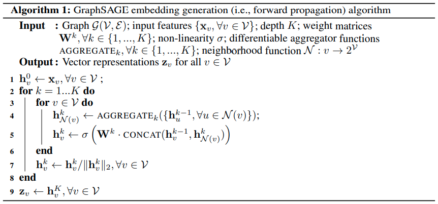

# GraphSAGE

## Approach
- inductive node embedding
- embedding function that generalizes to unseen nodes
- neighborhood (features)

## Description
- no training of distinct embedding vectors for each node
- set of aggregation functions
  - trained to aggregate information from a node's neighborhood

## Algorithm

---

**Line 1 -** For each node initial its feature vector

**Line 2 -** Iterate over each GraphSAGE layer

**Line 3 -** Iterate over each node

**Line 4 -** Aggregate neighbors features / already updated vectors

**Line 5 -** Concatenate current representation with aggregated neighbors, multiply it with this layers matrix and apply a non-linear function

**Line 7 -** Normalize vector
