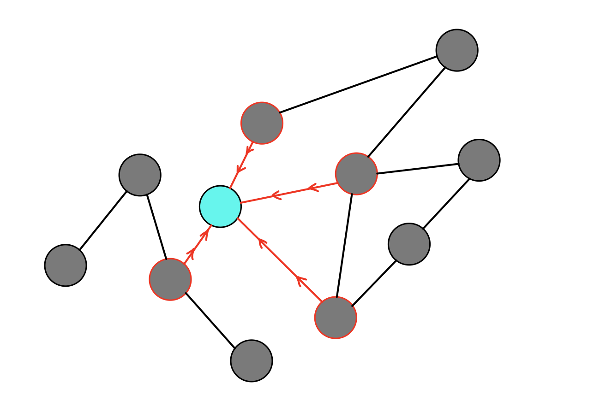
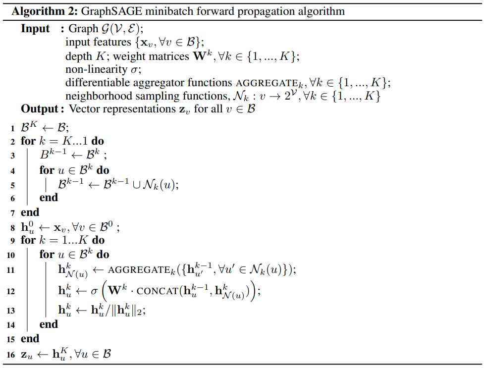
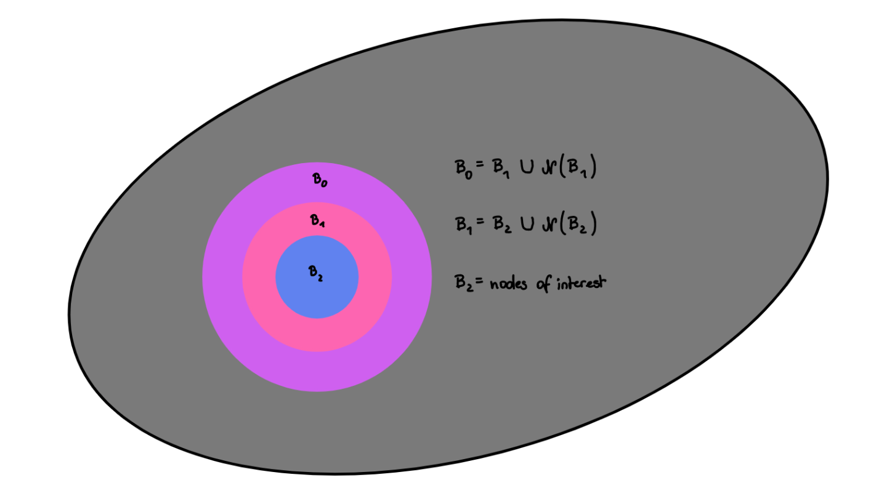

# GraphSAGE

## Approach
- inductive node embedding
- embedding function that generalizes to unseen nodes
- neighborhood (features)

## Description
- no training of distinct embedding vectors for each node
- set of aggregation functions
  - trained to aggregate information from a node's neighborhood

---

## Algorithm

**Line 1 -** For each node initial its feature vector

**Line 2 -** Iterate over each GraphSAGE layer

**Line 3 -** Iterate over each node

**Line 4 -** Aggregate neighbors features / already updated vectors

**Line 5 -** Concatenate current representation with aggregated neighbors, multiply it with this layers matrix and apply a non-linear function

**Line 7 -** Normalize vector

---

## Mini Batch Algorithm

**Line 1 -** B are the target nodes, the representation should be calculate for. Store them in B_K

**Line 3:5 -** Initialize B_K-1 with B_K ; collect all neighbors for those nodes ; Concatenate them to one set

**Line 8 -** For each node in B_0 initial its feature vector

**Line 9 -** Iterate over each GraphSAGE layer (B_K)

**Line 10 -** Iterate over each node

**Line 11 -** Aggregate neighbors features / already updated vectors

**Line 12 -** Concatenate current representation with aggregated neighbors, multiply it with this layers matrix and apply a non-linear function

**Line 13 -** Normalize vector

